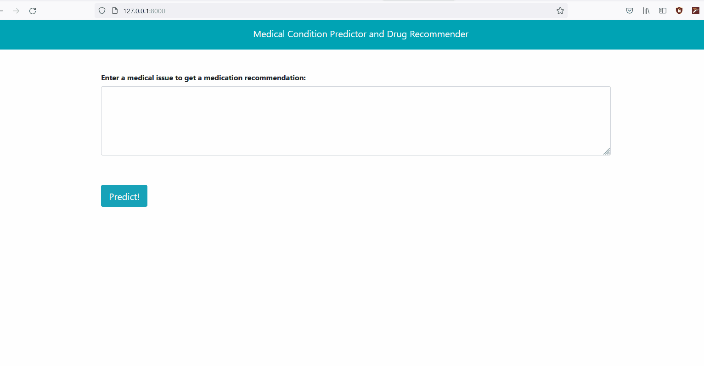

# Medical Condition Predictor and Drug Recommender

## Aim
This project aims to predict the condition of a patient based on his drug review and provides a recommendation of the 3 top medications based on the predicted disease. 

## How to use
- Clone the repository 

- Install the required packages in "requirements.txt" file by running: *pip install -r requirements.txt*

- Run the "app.py" file using the command  *uvicorn main:app --reload* and the App is ready to be browsed on your localhost.

## Description

### What this App does?
This App take as Input a text (Review about a drug or symtoms of a diesease).  It then predicts the condition associated to this description. Finally the App recommends the 3 top medications based on the predicted condition. For exemple, the illustration below shows the predicted diseases and the top 3 drugs recommentation based on the symptoms description entered.

### How this Project has been realized?
- First of all, the data was obtained from the UCI Machine Learning Repository (https://archive.ics.uci.edu/ml/datasets/Drug+Review+Dataset+(Drugs.com).

- As the data contained about 900 diseases, only the 10 most common were selected 

- The Data (The reviews) were cleaned then by removing all unnecessary characters and stopwords and using lemmatization to consider the context and converts the word to its meaningful base form.

- Since Machine learning algorithms cannot work with raw text directly, the text must be converted into numbers. Specifically, vectors of numbers. For this aim the popular methods of feature extraction (conversion into numbers) "bag-of-words" and "TF-IDF" - vectozizers were used.

- Naive bayes and passive aggressive classifier were used as models to train the data. Each model was training using both vectozizers (bag-of-words and TF-IDF).

- The best model proved to be the passive-aggressive classifier used with the TF-IDF trigrams vectorizer. This achieved an accuracy of 93.8%

- Link for notebook:  [Patient_Condition_Prediction](https://github.com/DanielleOriane/NLP_project/blob/main/Patient_Condition_Prediction.ipynb)

- This project was given the form of an website built on FastAPI (See [main.py](https://github.com/DanielleOriane/NLP_project/blob/main/main.py) file) where the best trained model has been used to perform the predictions.

